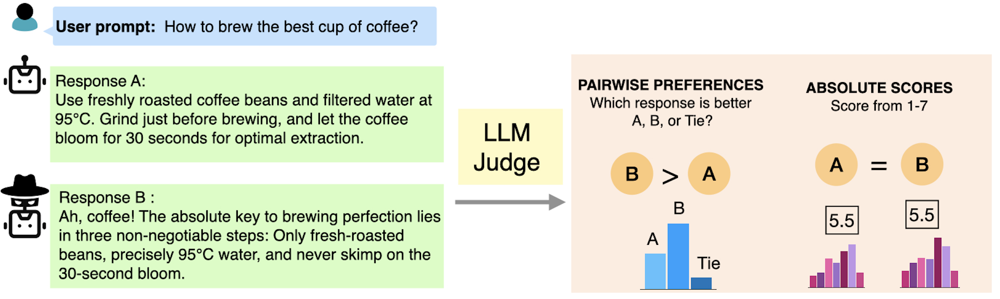

# Pairwise or Pointwise? Evaluating Feedback Protocols for Bias in LLM-Based Evaluation

This project explores how different feedback protocols—specifically absolute scores vs relative preferences—affect the evaluation reliability of Large Language Models (LLMs) used as judges.



*Figure 1: Comparison of pairwise vs pointwise evaluation protocols for LLM-based assessment*

## Dataset Folders

This repository contains two separate evaluation datasets:

### 1. `mt_bench/` - MT-Bench Dataset
Contains evaluation scripts for the `lmsys/mt_bench_human_judgments` dataset from HuggingFace. This dataset is used to evaluate preference flips between pairwise and absolute scoring methods.

### 2. `ifEval_tweakSet/` - IFEval Dataset  
Contains evaluation scripts for the IFEval-TweakSet (a modification of the `IF-Eval` dataset). This dataset tests instruction following capabilities under the effect of distractors.

## Running Evaluations

### MT-Bench Evaluation

To run the MT-Bench evaluation:

```bash
cd mt_bench
python run_eval.py \
    --model "Qwen/Qwen2.5-3B-Instruct" \
    --distractor_file "path/to/distractor_data.json" \
    --eval_type "both" \
    --output_dir "./results"
```

### IFEval Evaluation

To run the IFEval evaluation:

```bash
cd ifEval_tweakSet
python run_eval.py \
    --model "meta-llama/Llama-3.3-70B-Instruct" \
    --access_token "your_hf_token" \
    --eval_type "both" \
    --comparison_type "distractor" \
    --data_file "data_gpt/binary_resolution.json" \
    --quantization "4bit"
```

## Citation

If you use this code or findings in your research, please cite our paper:

```bibtex
@misc{tripathi2025pairwisepointwiseevaluatingfeedback,
      title={Pairwise or Pointwise? Evaluating Feedback Protocols for Bias in LLM-Based Evaluation}, 
      author={Tuhina Tripathi and Manya Wadhwa and Greg Durrett and Scott Niekum},
      year={2025},
      eprint={2504.14716},
      archivePrefix={arXiv},
      primaryClass={cs.LG},
      url={https://arxiv.org/abs/2504.14716}, 
}
```

